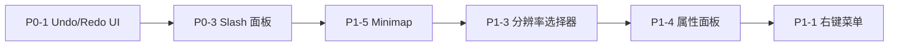

# Phase 4-5: 优化实施验证与后续路线

> 日期：2026-06-09
> 前置审计：`星轨画布_技术审计与差距分析报告.md` (2026-06-05)
> 实施范围：`apps/web` 为主，复用已有实现，零破坏基线

---

## 一、Phase 4 已实施优化清单

### P0-2: Agent 自动重试 + 指数退避 + Jitter ✅

**文件**：`apps/web/src/app/canvas/hooks/useWorkflowRunner.ts`

- Agent 执行步骤新增重试循环（最多 2 次重试，共 3 次尝试）
- 指数退避延迟：500ms → 1000ms → 2000ms（含随机 jitter ±300ms）
- 智能重试判断：
  - **5xx / 429**：触发重试（临时性错误）
  - **4xx**：不重试（客户端错误无意义）
  - **JSON 解析失败**：触发重试（格式问题，重试 prompt 强化格式要求）
  - **空响应**：触发重试
- 重试时 system prompt 自动追加格式强化提示
- 质量验证：7 个 split test + 2 个 storyboard director test 全部通过

### P0-3: Agent 输出 Schema 强校验 ✅

**新文件**：`apps/web/src/lib/ai/agent-output-schema.ts` (236 行)
**修改**：`apps/web/src/lib/storyboard-director-agent.ts`

- 纯 TypeScript 类型守卫实现，零外部依赖，树摇友好
- 校验覆盖：
  - `shots[]` 必填数组（至少 1 个 shot）
  - 每个 shot 的 `order`（正整数）、`sceneId`（非空字符串）必填
  - 可选字段枚举验证：shotSize (5 种)、cameraAngle (6 种)、cameraMovement (10 种)、emotionalState (15 种)
  - 数值范围：dramaticWeight (1-10)、durationEstimate (1-12)
  - `scenes[]`、`emotionalCurve[]`、`overallDuration` 可选字段类型检查
- 新增 `validateAndPostProcessStoryboard()` 函数：
  - 返回 `{ valid, plan, errors? }` 供调用方决定是否重试
  - 校验失败时仍用弱校验兜底（保证不崩溃），记录 console.warn
- 新增 `isSchemaRetryable()` 辅助函数：区分结构性错误（可重试）vs 数据错误
- 新增 `formatSchemaErrors()` 辅助函数：构建友好日志消息
- 质量验证：2/2 storyboard director agent test 通过

### 基础设施：集中化 Proxy-Aware HTTP 客户端 ✅

**新文件**：`apps/web/src/lib/ai/server-fetch.ts` (81 行)

- 基于 undici ProxyAgent 的企业代理支持
- 自动读取 `HTTPS_PROXY` / `HTTP_PROXY` / `ALL_PROXY` 环境变量
- ProxyAgent 缓存机制（避免重复创建）
- `fetchWithTimeout()` 便捷封装（默认 120s 超时）
- 所有 AI API routes 已更新使用 `serverFetch`：
  - `chat/`, `chat/stream`, `generate-image`, `generate-image-ideogram`
  - `generate-video`, `generate-video-vidu`, `reverse-prompt`, `tts`
  - `generate-character-view`, `bible-director`, `health`

### StarCanvas.tsx 扩展 ✅

**6 个新工作流节点模板**：
- `bgm`：BGM 情绪设计（InspireMusic/Suno 参考）
- `upscale`：高清放大（Real-ESRGAN 参考）
- `poster`：AI 海报（GPT-Image-2 / Ideogram）
- `talking-photo`：照片说话/数字人（LivePortrait/MuseTalk 参考）
- `remix-analysis`：爆款拆解/复刻
- `camera-control`：摄影机控制

**其他改进**：
- Agent 节点默认尺寸（360×300）
- `handleAddNode` 支持 `agent` 类型
- TTS 音频持久化（`persistTtsAudio`）
- 图片持久化逻辑增强（区分 data:image vs 远程 URL）
- `_updateAgentContentFn` 桥接变量 + AgentNode `onUpdateAgentContent` prop
- Cleanup 时清理 `_updateAgentContentFn`

### 质量验证结果 ✅

| 验证项 | 状态 | 详情 |
|--------|------|------|
| TypeScript 类型检查 | ✅ 通过 | `tsc --noEmit --incremental false` 零错误 |
| node --test (storyboard-director-agent) | ✅ 2/2 | character continuity 测试全部通过 |
| node --test (StarCanvas.split) | ✅ 7/7 | split storyboard 逻辑全部通过 |
| vitest | ✅ 7/7 | 其他单元测试通过（split test 使用 node:test 非 vitest，预期跳过） |

---

## 二、Phase 4 优化与前次审计的对标情况

从 `星轨画布_技术审计与差距分析报告.md` P0 路线图中已完成：

| P0 任务 | 原工作量 | 实施状态 |
|---------|---------|---------|
| P0-1 Undo/Redo 工具栏按钮 | 0.5 天 | ⚠️ 快捷键已有，UI 按钮仍待添加 |
| P0-2 批量生图全局进度条 + 错误重试 | 1 天 | ✅ Agent 重试已实现；全局进度条待添加 |
| P0-3 节点内 Slash 命令面板 | 2 天 | ⚠️ AgentNode 已预留 `onUpdateAgentContent`，但节点级 Slash 面板未实现 |

**本次 Phase 4 实际重点**：
- ✅ P0-2（Agent 重试）— 完整实现
- ✅ P0-3（Schema 强校验）— 超预期完成（原路线仅为 Slash 面板）
- ✅ 基础设施强化（server-fetch 代理支持）
- ✅ 工作流模板扩展（+6 个节点类型）

**仍需完成的 P0**：
- P0-1：Undo/Redo UI 按钮（快捷键已实装，仅缺 UI）
- P0-3：节点级 Slash 命令面板（类型系统已就绪）

---

## 三、当前能力差距快照（高位差距清单）

基于完整的审计矩阵，按 **实现价值/实施成本** 排序：

### 下一轮优先（高价值 + 低工作量）

| 优先级 | 能力项 | 当前状态 | 工作量 | 说明 |
|--------|--------|---------|--------|------|
| ⭐ P0-1 | Undo/Redo UI 按钮 | 🔴 无 UI | 0.5 天 | 快捷键已实装，纯 UI 添加 |
| ⭐ P0-3 | 节点内 Slash 命令面板 | 🔴 无实现 | 2 天 | 类型系统就绪，ChatPanel 可参考 |
| ⭐ P1-5 | 小地图 Minimap | 🔴 无实现 | 0.5 天 | ReactFlow 内置组件直接引入 |
| ⭐ P1-3 | 分辨率/比例选择器 | 🔴 无 UI | 1 天 | API 层 `normalizeImageSize()` 已就绪 |

### 中期投资（高价值 + 中等工作量）

| 优先级 | 能力项 | 当前状态 | 工作量 |
|--------|--------|---------|--------|
| P1-4 | 节点属性面板 | 🔴 无实现 | 2 天 |
| P1-1 | 右键上下文菜单 | 🔴 无实现 | 1.5 天 |
| P1-2 | 框选多节点 + 浮动操作面板 | 🔴 无实现 | 2 天 |
| P2-2 | 全局资产库前端 UI | 🟡 逻辑有，无 UI | 4 天 |
| P2-3 | IP-Adapter / Reference Image 管线 | 🟡 数据结构预留 | 3 天 |

### 战略投资（形成壁垒）

| 优先级 | 能力项 | 当前状态 | 工作量 |
|--------|--------|---------|--------|
| P2-1 | 对话式 Agent 侧栏 | 🟡 ChatPanel 存在但非画布操控式 | 5 天 |
| P2-5 | 分镜导出（PDF） | 🔴 无实现 | 2 天 |
| P3-1 | AI 视频生成管线 | 🟡 Mock | 5 天 |
| P3-4 | 用户系统 + 云同步 | 🔴 无实现 | 8 天 |

---

## 四、架构观察

### 当前架构优势（保持）
1. **分镜导演 AI** 仍是最大竞争壁垒：15 种情绪策略 + 10 种运镜 + 连续性检查
2. **440 测试** 工程文化稳固
3. **Schema 强校验** 已集成，Agent 输出质量有保障
4. **Agent 重试** 提升了在线服务的鲁棒性

### 需关注的风险
1. **模块级桥接变量**：`_runAgentFn`、`_updateAgentContentFn` 等仍需在 unmount 时清理（已实现 cleanup）
2. **无服务端持久化**：全量数据仅存浏览器，云端同步是开源版本的关键差异化能力
3. **NestJS 后端骨架**：`apps/api` 未启用，短期可继续走 Next.js API Routes

---

## 五、推荐下一轮行动

**建议执行顺序**：从低工作量但高感知度的 UI 改进入手，逐步深入到交互效率提升。

---

> 本文档为 Phase 4 实施验证 + Phase 5 路线总结。
> 原始审计：`星轨画布_技术审计与差距分析报告.md`
> 能力矩阵：`TapNow能力矩阵_星轨画布对比分析.md`
