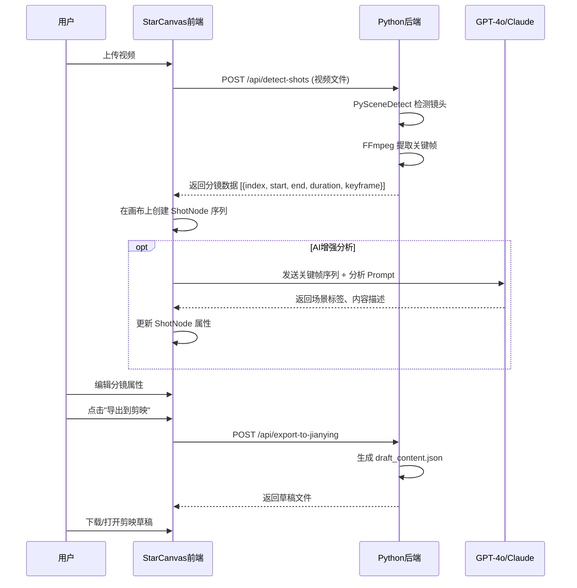

# 剪映草稿导出格式逆向与一键拉片功能完整实现方案

> 版本：v1.0
> 日期：2026-06-10
> 项目：StarCanvas（星轨画布）

---

## 目录

1. [剪映草稿格式逆向分析](#1-剪映草稿格式逆向分析)
2. [开源项目调研报告](#2-开源项目调研报告)
3. [可直接使用的 npm 包清单](#3-可直接使用的-npm-包清单)
4. [可直接复制使用的代码片段](#4-可直接复制使用的代码片段)
5. [一键拉片完整方案](#5-一键拉片完整方案)
6. [分阶段实施计划](#6-分阶段实施计划)
7. [集成架构方案](#7-集成架构方案)

---

## 1. 剪映草稿格式逆向分析

### 1.1 草稿文件组成

剪映（JianYing Pro）的草稿存储在 `~/Documents/JianYingPro/Drafts/<草稿名称>/` 目录下，核心文件为：

| 文件名 | 说明 |
|:---|:---|
| `draft_content.json`（剪映）/ `draft_info.json`（CapCut） | 草稿核心数据：时间线、轨道、片段、素材、特效 |
| `draft_meta_info.json` | 草稿元信息：草稿ID、创建时间、版本、分辨率、帧率 |
| `cover.jpg` | 封面缩略图（自动生成） |
| `素材/` 目录 | 引用的媒体文件副本 |

**自动补全机制**：仅需生成 `draft_content.json` 和 `draft_meta_info.json` 两个文件，剪映在打开草稿时自动补全其他依赖文件（缩略图、缓存等）。

### 1.2 `draft_content.json` 完整 JSON Schema

```jsonc
{
  "id": "<UUID>",
  "name": "草稿名称",
  "duration": 5000000,          // 微秒（全部时间单位均为微秒）
  "fps": 30,                    // 帧率
  "canvas_config": {
    "width": 1920,
    "height": 1080,
    "background_color": "#000000"
  },
  "tracks": [                    // 扁平列表，包含所有轨道
    {
      "id": "<UUID>",
      "type": "video",          // video | audio | text | image | sticker | effect | subtitle | filter
      "name": "视频轨道 1",
      "flag": 0,
      "segments": [             // 该轨道上的所有片段
        {
          "id": "<UUID>",
          "material_id": "<素材UUID>",
          "target_timerange": { "start": 0, "duration": 5000000 },
          "source_timerange": { "start": 0, "duration": 10000000 },
          "clip": {
            "speed": 1.0,
            "volume": 1.0,
            "alpha": 1.0,
            "transform_x": 0,
            "transform_y": 0,
            "scale": 1.0,
            "rotation": 0
          },
          "render_index": 0,
          "extra_material_refs": []    // 附加素材引用（特效、动画等）
        }
      ]
    }
  ],
  "materials": {                 // 扁平字典，包含所有素材
    "videos": {
      "<UUID>": {
        "id": "<UUID>",
        "type": "video",
        "path": "/absolute/path/to/video.mp4",
        "duration": 10000000,
        "width": 1920,
        "height": 1080,
        "format": "mp4"
      }
    },
    "audios": { /* 同上结构 */ },
    "texts": {
      "<UUID>": {
        "id": "<UUID>",
        "type": "text",
        "content": "{\"text\":\"被双重编码的JSON字符串\"}",  // 双重编码！
        "font": 361595,
        "size": 10.0,
        "color": "#FF0000"
      }
    },
    "stickers": { /* 贴纸素材 */ },
    "video_effects": { /* 视频特效素材 */ },
    "material_animations": { /* 动画素材 */ },
    "transitions": { /* 转场素材 */ },
    "masks": { /* 蒙版素材 */ },
    "canvases": { /* 画布素材 */ }
  },
  "platform": {
    "app_source": "JianYing Pro"  // 区分国内版/海外版
  }
}
```

### 1.3 `draft_meta_info.json` 完整 JSON Schema

```jsonc
{
  "draft_id": "auto_generated_draft",
  "create_time": "2026-06-10T12:00:00",
  "version": "7.5.0",          // 剪映版本号
  "resolution": "1920x1080",
  "frame_rate": 30,
  "duration": 5000000          // 微秒
}
```

### 1.4 关键约定

| 字段 | 规则 |
|:---|:---|
| **时间单位** | 全部使用微秒（`us`）。1秒 = 1,000,000 微秒 |
| **坐标系** | 归一化 `-1 ~ 1` 范围，原点 `(0,0)` 在画面中心，左上角为 `(-1, -1)` |
| **缩放** | 无单位乘数，`1.0` 为原始大小 |
| **旋转** | 顺时针角度 |
| **ID** | UUID格式 |
| **路径** | 必须使用绝对路径（`/absolute/path/to/file.mp4`） |
| **编码** | UTF-8 JSON |
| **文本content** | 双重编码：`content` 的值本身是包含转义JSON的JSON字符串 |

### 1.5 版本差异（CapCut vs 剪映）

| 差异项 | CapCut（海外版） | 剪映/JianYing（国内版） |
|:---|:---|:---|
| 文件名 | `draft_content.json` | `draft_info.json` |
| `platform.app_source` | `"CapCut"` | `"JianYing Pro"` |
| 枚举ID | 不同ID映射 | 不同ID映射 |
| CLI参数 | 默认 | 添加 `--jianying` |

### 1.6 轨道类型与片段详解

**轨道类型枚举**：`video` | `audio` | `text` | `image` | `sticker` | `effect` | `subtitle` | `filter`

**片段核心字段**：

```jsonc
{
  "material_id": "引用素材的UUID",
  "target_timerange": {
    "start": 0,          // 在时间轴上的起始位置（微秒）
    "duration": 5000000  // 在时间轴上的持续时长（微秒）
  },
  "source_timerange": {
    "start": 0,          // 在原始素材中的截取起始点（微秒）
    "duration": 10000000 // 在原始素材中的截取时长（微秒）
  },
  "clip": {
    "speed": 1.0,        // 变速倍率
    "volume": 1.0,       // 音量 0.0~1.0
    "alpha": 1.0,        // 透明度 0.0~1.0
    "transform_x": 0,    // X轴偏移（归一化坐标）
    "transform_y": 0,    // Y轴偏移（归一化坐标）
    "scale": 1.0,        // 缩放
    "rotation": 0        // 旋转角度
  },
  "common_keyframes": [   // 关键帧动画
    {
      "id": "<UUID>",
      "property": "alpha",
      "points": [
        { "position": 0, "value": 1.0 },
        { "position": 5000000, "value": 0.0 }
      ]
    }
  ],
  "extra_material_refs": [], // 转场、特效等附加素材引用
  "render_index": 0          // 渲染层级（控制遮挡关系）
}
```

---

## 2. 开源项目调研报告

### 2.1 剪映草稿生成类

#### 2.1.1 pyJianYingDraft ★★★★★

| 属性 | 详情 |
|:---|:---|
| **GitHub** | https://github.com/GuanYixuan/pyJianYingDraft |
| **许可证** | **Apache-2.0**（可商用） |
| **Stars** | 3.4k |
| **语言** | Python |
| **关联度** | ⭐⭐⭐⭐⭐ **极高 —— 核心依赖** |
| **安装** | `pip install pyJianYingDraft` |
| **支持功能** | 视频/音频/文本/贴纸/特效/滤镜/转场/蒙版/关键帧动画/气泡花字/SRT字幕导入/模板模式/变速/音频淡入淡出/混合模式 |
| **版本兼容** | 剪映 5.x 及以上（草稿生成）；模板模式仅 5.9 及以下；自动导出仅 Windows + 剪映 6 及以下 |
| **可复用模块** | 完整的 `ScriptFile`、`DraftFolder`、`VideoSegment`、`AudioSegment`、`TextSegment`、`ClipSettings` 类 |

**可直接复制的 demo.py**：

```python
import os
import pyJianYingDraft as draft
from pyJianYingDraft import IntroType, TransitionType, trange, tim, ClipSettings, TextStyle, FontType

# 1. 初始化
draft_folder = draft.DraftFolder("~/Documents/JianYingPro/Drafts/")
script = draft_folder.create_draft("MyDraft", 1920, 1080, allow_replace=True)

# 2. 添加轨道
script.add_track(draft.TrackType.audio).add_track(draft.TrackType.video).add_track(draft.TrackType.text)

# 3. 音频：添加背景音乐 + 淡入
audio_seg = draft.AudioSegment("music.mp3", trange("0s", "10s"), volume=0.6)
audio_seg.add_fade("1s", "2s")  # 淡入1秒，淡出2秒
script.add_segment(audio_seg)

# 4. 视频：添加视频片段 + 入场动画 + 转场
video_seg = draft.VideoSegment("video.mp4", trange("0s", "4.2s"))
video_seg.add_animation(IntroType.斜切)
script.add_segment(video_seg)

# 5. 文本：添加文字 + 气泡 + 花字
text_seg = draft.TextSegment(
    "StarCanvas 自动生成",
    video_seg.target_timerange,
    font=FontType.文轩体,
    style=TextStyle(color=(1.0, 1.0, 0.0), size=8.0),
    clip_settings=ClipSettings(transform_y=-0.8)
)
text_seg.add_animation(draft.TextOutro.故障闪动, duration=tim("1s"))
text_seg.add_bubble("361595", "6742029398926430728")  # 气泡素材ID
script.add_segment(text_seg)

# 6. 保存
script.save()
```

#### 2.1.2 cut_cli (cutcli) ★★★★★

| 属性 | 详情 |
|:---|:---|
| **官网** | https://cutcli.com/ |
| **文档** | https://docs.cutcli.com/zh/ |
| **许可证** | 商业 + 免费额度（CLI 免费使用） |
| **安装** | `curl -fsSL https://cutcli.com/install.sh \| bash` |
| **支持功能** | 字幕/图片/视频/音频/特效/滤镜/关键帧动画/MCP Server 集成 / 云端渲染 |
| **关联度** | ⭐⭐⭐⭐⭐ **极高 —— 可直接在 StarCanvas 中集成调用** |

**特色**：
- 单一二进制 CLI 工具，无需 Python 环境
- 内置 MCP Server，可与 AI 编辑器（Cursor、Claude Code、OpenClaw）集成
- 支持从 URL 自动下载素材
- 支持云端渲染输出 MP4

**使用示例**：
```bash
# 创建草稿
cutcli draft create --width 1920 --height 1080

# 批量添加字幕
cutcli captions add <draftId> --captions '[
  {"text":"第一句台词","start":0,"end":3000000},
  {"text":"第二句台词","start":3000000,"end":6000000}
]' --font-size 8 --bold

# 添加图片（自动下载）
cutcli images add <draftId> --image-infos '[
  {"imageUrl":"https://example.com/bg.jpg","width":1920,"height":1080,"start":0,"end":6000000}
]'

# 添加音频
cutcli audios add <draftId> --audio-infos '[
  {"audioUrl":"https://example.com/bgm.mp3","duration":6000000,"start":0,"end":6000000}
]'

# 云端渲染
cutcli cloud render <draftId> --wait
```

#### 2.1.3 capcut-cli ★★★★

| 属性 | 详情 |
|:---|:---|
| **GitHub** | https://github.com/renezander030/capcut-cli |
| **许可证** | 需确认（开源公共仓库） |
| **语言** | TypeScript |
| **关联度** | ⭐⭐⭐⭐ 高 —— draft schema 文档是重要参考 |

**核心价值**：其 `docs/draft-schema/` 目录提供了剪映草稿格式的字段级参考文档，包含 6 个 markdown 文件的完整说明体系。

#### 2.1.4 JyDraft ★★★

| 属性 | 详情 |
|:---|:---|
| **GitHub** | https://github.com/HTWMedia/JyDraft |
| **许可证** | Apache-2.0 |
| **Stars** | 81 |
| **语言** | C# |
| **关联度** | ⭐⭐⭐ 中 —— 云端渲染调度逻辑可参考 |

### 2.2 场景检测 / 镜头分割类

#### 2.2.1 PySceneDetect ★★★★★

| 属性 | 详情 |
|:---|:---|
| **GitHub** | https://github.com/Breakthrough/PySceneDetect |
| **官网** | https://www.scenedetect.com/ |
| **许可证** | **BSD-3-Clause**（可商用） |
| **Stars** | 4.9k |
| **语言** | Python |
| **安装** | `pip install scenedetect[opencv]` |

**检测算法**：
- **Content-Aware**（`detect-content`）：基于帧间HSV直方图差异，自适应阈值
- **Threshold**（`detect-threshold`）：基于帧亮度阈值，检测淡入淡出
- **Adaptive**：自适应检测，组合多种指标

**使用示例（Python API）**：
```python
from scenedetect import detect, ContentDetector, split_video_ffmpeg

# 自动检测场景边界
scenes = detect("input_video.mp4", ContentDetector(threshold=27.0))

# 打印每个场景的起止时间
for i, scene in enumerate(scenes):
    start_time = scene[0].get_seconds()
    end_time = scene[1].get_seconds()
    print(f"Scene {i+1}: {start_time:.2f}s - {end_time:.2f}s (时长: {end_time-start_time:.2f}s)")

# 自动切分视频为片段
split_video_ffmpeg("input_video.mp4", scenes, output_dir="./scenes/")
```

**命令行**：
```bash
# 检测并输出CSV
scenedetect -i input.mp4 detect-content -t 27 list-scenes

# 检测并切片
scenedetect -i input.mp4 detect-content -t 27 split-video

# 检测 + 提取关键帧
scenedetect -i input.mp4 detect-content -t 27 save-images
```

#### 2.2.2 TransNetV2 ★★★★

| 属性 | 详情 |
|:---|:---|
| **GitHub** | https://github.com/soCzech/TransNetV2 |
| **PyPI** | https://pypi.org/project/transnetv2-pytorch/ |
| **许可证** | MIT |
| **Stars** | 2.5k |
| **语言** | Python / TensorFlow / PyTorch |

**特色**：基于深度学习的镜头边界检测，SOTA 精度，支持 PyTorch 版本。

**使用示例**：
```python
from transnetv2 import TransNetV2

model = TransNetV2()
video_frames, predictions, scenes = model.predict_video("input_video.mp4")

for i, (start, end) in enumerate(scenes):
    print(f"Shot {i+1}: {start} - {end} (帧号)")
```

#### 2.2.3 FFmpeg Select Filter 场景检测 ★★★

纯 FFmpeg 实现，零依赖，适合快速原型：
```bash
# 检测场景变化并提取关键帧
ffmpeg -i input.mp4 -vf "select='gt(scene,0.4)',showinfo" -vsync vfr -f null -

# 提取关键帧（I帧）
ffmpeg -i input.mp4 -vf "select=eq(pict_type\,I)" -vsync vfr thumb_%04d.png
```

### 2.3 视频分析 AI 服务

#### GPT-4o 视频分析
- 支持通过关键帧序列发送给 GPT-4o Vision API 进行分析
- 流程：视频 → 拆帧（关键帧/等间隔） → 分析每帧 → LLM 合并描述 → 输出分镜元数据
- 参考：https://github.com/openai/openai-cookbook 中关于 video analysis 的示例

#### Claude 视频分析
- Claude 3.5/3 支持图片序列输入分析
- 同样采用「拆帧→逐帧分析→汇总」策略

**推荐方案**：PySceneDetect 做镜头检测 → 提取每个镜头首/中/尾 3 帧 → 发送给 GPT-4o/Claude 做场景描述 → 生成结构化分镜数据

---

## 3. 可直接使用的 npm 包清单

### 3.1 视频合成与处理

| npm 包 | 版本 | 用途 | 安装 |
|:---|:---|:---|:---|
| `@ffmpeg/ffmpeg` | ^0.12.x | 浏览器端 FFmpeg（WASM） | `npm i @ffmpeg/ffmpeg @ffmpeg/util` |
| `@ffmpeg/util` | ^0.12.x | FFmpeg 工具函数 | 同上 |
| `@ffmpeg/core` | ^0.12.x | FFmpeg WASM 核心 | `npm i @ffmpeg/core` |
| `opencv.js` | 4.x | 浏览器端 OpenCV（WASM） | CDN 引入 |
| `fluent-ffmpeg` | ^2.x | Node.js 端 FFmpeg 包装 | `npm i fluent-ffmpeg`（服务端用） |

### 3.2 节点式 UI

| npm 包 | 版本 | 用途 | 安装 |
|:---|:---|:---|:---|
| `@xyflow/react` | ^12.x | 节点式画布 UI 核心库 | `npm i @xyflow/react`（已在用） |
| `reactflow` | ^11.x | 旧版 React Flow | 建议升级到 v12 |

### 3.3 视频播放与帧提取（浏览器端）

| npm 包 | 版本 | 用途 | 安装 |
|:---|:---|:---|:---|
| `hls.js` | ^1.x | HLS 流播放 | 用于分镜预览 |
| `video.js` | ^8.x | HTML5 视频播放器 | 用于分镜预览 |
| `canvas-confetti` | ^1.x | 画布特效 | 装饰性 |
| `html2canvas` | ^1.x | HTML→Canvas 截图 | 分镜缩略图生成 |

### 3.4 数据序列化与通信

| npm 包 | 版本 | 用途 | 安装 |
|:---|:---|:---|:---|
| `nanoid` | ^5.x | 生成 UUID | `npm i nanoid` |
| `uuid` | ^9.x | UUID 生成 | `npm i uuid` |
| `zod` | ^3.x | JSON Schema 校验 | `npm i zod`（校验草稿 JSON） |
| `ws` | ^8.x | WebSocket 通信 | `npm i ws`（与 Python 后端通信） |

---

## 4. 可直接复制使用的代码片段

### 4.1 Node.js 调用 PySceneDetect 的封装

```typescript
// shot-detection.ts
// 通过 child_process 调用 Python 脚本进行镜头检测

import { execSync, spawn } from 'child_process';
import * as path from 'path';
import * as fs from 'fs';

export interface ShotInfo {
  index: number;
  start_time: number;  // 秒
  end_time: number;    // 秒
  duration: number;    // 秒
  keyframe_path: string; // 关键帧缩略图路径
}

/**
 * 使用 PySceneDetect 检测视频镜头
 */
export function detectShots(videoPath: string, threshold = 27): ShotInfo[] {
  const pythonScript = `
import sys, json
from scenedetect import detect, ContentDetector

video_path = sys.argv[1]
threshold = float(sys.argv[2])

scenes = detect(video_path, ContentDetector(threshold=threshold))
result = []
for i, (start, end) in enumerate(scenes):
    result.append({
        "index": i,
        "start_time": start.get_seconds(),
        "end_time": end.get_seconds(),
        "duration": end.get_seconds() - start.get_seconds()
    })
print(json.dumps(result))
`;

  const result = execSync(
    `python3 -c "${pythonScript.replace(/"/g, '\\"')}" "${videoPath}" ${threshold}`,
    { encoding: 'utf-8', maxBuffer: 50 * 1024 * 1024 }
  );

  return JSON.parse(result.trim());
}

/**
 * 提取每个镜头的关键帧（首帧）
 */
export function extractKeyframes(
  videoPath: string,
  shots: ShotInfo[],
  outputDir: string
): ShotInfo[] {
  if (!fs.existsSync(outputDir)) {
    fs.mkdirSync(outputDir, { recursive: true });
  }

  const updatedShots = [...shots];

  for (const shot of updatedShots) {
    const keyframePath = path.join(outputDir, `shot_${shot.index}_keyframe.jpg`);

    // 提取镜头中间帧作为关键帧
    const midTime = (shot.start_time + shot.end_time) / 2;
    execSync(
      `ffmpeg -y -i "${videoPath}" -ss ${midTime} -vframes 1 -q:v 2 "${keyframePath}"`,
      { encoding: 'utf-8' }
    );

    shot.keyframe_path = keyframePath;
  }

  return updatedShots;
}
```

### 4.2 Python 生成剪映草稿的完整脚本

```python
# generate_jianying_draft.py
# 从结构化分镜数据生成剪映草稿

import os
import json
import pyJianYingDraft as draft
from pyJianYingDraft import trange, tim, IntroType, TransitionType, TextStyle, FontType, ClipSettings

class JianYingDraftExporter:
    """
    将 StarCanvas 的创作结果导出为剪映草稿
    """

    def __init__(self, draft_folder_path: str, draft_name: str, width=1920, height=1080):
        self.draft_folder = draft.DraftFolder(draft_folder_path)
        self.script = self.draft_folder.create_draft(
            draft_name, width, height, allow_replace=True
        )
        self.width = width
        self.height = height

    def add_video_track(self, shots_data: list[dict]):
        """
        添加视频轨道，shots_data 为镜头列表
        每个镜头：{
            "media_path": str,
            "start": float,   # 截取起始（秒）
            "duration": float, # 截取时长（秒）
            "animation": str | None,
            "transition": str | None
        }
        """
        self.script.add_track(draft.TrackType.video)
        prev_segment = None

        for shot in shots_data:
            seg = draft.VideoSegment(
                shot["media_path"],
                trange(shot.get("target_start", 0), shot["duration"]),
                source_timerange=trange(shot["start"], shot["duration"]),
                clip_settings=ClipSettings(
                    alpha=shot.get("alpha", 1.0),
                    scale=shot.get("scale", 1.0)
                )
            )

            # 添加入场动画
            if shot.get("animation"):
                try:
                    anim_type = getattr(IntroType, shot["animation"], None)
                    if anim_type:
                        seg.add_animation(anim_type)
                except (AttributeError, TypeError):
                    pass

            # 添加转场
            if shot.get("transition") and prev_segment:
                try:
                    trans_type = getattr(TransitionType, shot["transition"], None)
                    if trans_type:
                        seg.add_transition(trans_type)
                except (AttributeError, TypeError):
                    pass

            self.script.add_segment(seg)
            prev_segment = seg

    def add_audio_track(self, audio_data: list[dict]):
        """
        添加音频轨道
        每个音频：{
            "media_path": str,
            "start": float,
            "duration": float,
            "volume": float,
            "fade_in": float,
            "fade_out": float
        }
        """
        self.script.add_track(draft.TrackType.audio)

        for audio in audio_data:
            seg = draft.AudioSegment(
                audio["media_path"],
                trange(audio.get("target_start", 0), audio["duration"]),
                volume=audio.get("volume", 1.0)
            )
            fade_in = audio.get("fade_in", 0)
            fade_out = audio.get("fade_out", 0)
            if fade_in > 0 or fade_out > 0:
                seg.add_fade(f"{fade_in}s", f"{fade_out}s")
            self.script.add_segment(seg)

    def add_text_track(self, text_data: list[dict]):
        """
        添加文字轨道
        每个文字：{
            "content": str,
            "start": float,
            "duration": float,
            "font": str | None,
            "color": tuple | None,
            "size": float,
            "position_y": float,
            "animation": str | None
        }
        """
        self.script.add_track(draft.TrackType.text)

        for text in text_data:
            seg = draft.TextSegment(
                text["content"],
                trange(text["start"], text["duration"]),
                font=getattr(FontType, text.get("font", "文轩体"), FontType.文轩体),
                style=TextStyle(
                    size=text.get("size", 8.0),
                    color=text.get("color", (1.0, 1.0, 1.0))
                ),
                clip_settings=ClipSettings(
                    transform_y=text.get("position_y", 0)
                )
            )
            self.script.add_segment(seg)

    def save(self):
        """保存草稿"""
        self.script.save()
        print(f"剪映草稿已保存: {self.draft_folder.draft_dir}")


# ========== 使用示例 ==========
if __name__ == "__main__":
    exporter = JianYingDraftExporter(
        draft_folder_path="~/Documents/JianYingPro/Drafts/",
        draft_name="StarCanvas_Export"
    )

    # 添加分镜镜头
    exporter.add_video_track([
        {"media_path": "/path/to/shot1.mp4", "start": 0, "duration": 5.0, "animation": "斜切"},
        {"media_path": "/path/to/shot2.mp4", "start": 0, "duration": 3.0, "transition": "信号故障"},
        {"media_path": "/path/to/shot3.mp4", "start": 0, "duration": 4.0},
    ])

    # 添加背景音乐
    exporter.add_audio_track([
        {"media_path": "/path/to/bgm.mp3", "target_start": 0, "duration": 12.0,
         "volume": 0.7, "fade_in": 1.0, "fade_out": 2.0}
    ])

    # 添加字幕
    exporter.add_text_track([
        {"content": "第一幕", "start": 0, "duration": 3.0,
         "size": 10.0, "position_y": 0.8, "color": (1.0, 1.0, 0.0)},
        {"content": "第二幕", "start": 5.0, "duration": 3.0,
         "size": 10.0, "position_y": 0.8},
    ])

    exporter.save()
```

### 4.3 浏览器端使用 OpenCV.js 做简单镜头检测

```html
<!-- 通过 CDN 引入 OpenCV.js -->
<script async src="https://docs.opencv.org/4.9.0/opencv.js" onload="onOpenCvReady()">
</script>

<script>
// 简单的帧差法场景检测
let cvReady = false;

function onOpenCvReady() {
  cvReady = true;
  console.log('OpenCV.js 已加载');
}

async function detectSceneChanges(videoFile, threshold = 30) {
  if (!cvReady) {
    await new Promise((resolve) => {
      const check = () => {
        if (cvReady) resolve();
        else setTimeout(check, 100);
      };
      check();
    });
  }

  const video = document.createElement('video');
  video.src = URL.createObjectURL(videoFile);
  await video.play();

  const canvas = document.createElement('canvas');
  const ctx = canvas.getContext('2d');
  canvas.width = 320;  // 缩放到小尺寸以提高性能
  canvas.height = 180;

  const scenes = [];
  let prevFrame = null;
  let frameIndex = 0;
  let sceneStart = 0;

  const totalFrames = Math.floor(video.duration * video.fps || 30);

  for (let i = 0; i < totalFrames; i++) {
    video.currentTime = i / (video.fps || 30);
    await new Promise((r) => { video.onseeked = r; });

    ctx.drawImage(video, 0, 0, canvas.width, canvas.height);
    const imageData = ctx.getImageData(0, 0, canvas.width, canvas.height);

    const src = cv.matFromImageData(imageData);
    const gray = new cv.Mat();
    cv.cvtColor(src, gray, cv.COLOR_RGBA2GRAY);

    if (prevFrame) {
      const diff = new cv.Mat();
      cv.absdiff(gray, prevFrame, diff);
      const mean = cv.mean(diff)[0];

      if (mean > threshold) {
        const endTime = i / (video.fps || 30);
        scenes.push({
          index: scenes.length,
          start_time: sceneStart,
          end_time: endTime,
          duration: endTime - sceneStart
        });
        sceneStart = endTime;
      }
      diff.delete();
    }

    if (prevFrame) prevFrame.delete();
    prevFrame = gray.clone();
    src.delete();
    frameIndex++;
  }

  // 添加最后一个场景
  scenes.push({
    index: scenes.length,
    start_time: sceneStart,
    end_time: video.duration,
    duration: video.duration - sceneStart
  });

  video.remove();
  return scenes;
}
</script>
```

### 4.4 生成剪映草稿 JSON 的 TypeScript 工具函数

```typescript
// jianying-draft.ts
// 直接生成 draft_content.json（不依赖 Python）

import { v4 as uuidv4 } from 'uuid';

// ========== 类型定义 ==========

interface Timerange {
  start: number;     // 微秒
  duration: number;  // 微秒
}

interface ClipSettings {
  speed?: number;
  volume?: number;
  alpha?: number;
  transform_x?: number;
  transform_y?: number;
  scale?: number;
  rotation?: number;
}

interface Segment {
  id: string;
  material_id: string;
  target_timerange: Timerange;
  source_timerange: Timerange;
  clip: ClipSettings;
  render_index: number;
  extra_material_refs: Array<{ id: string; type: string }>;
}

interface Track {
  id: string;
  type: 'video' | 'audio' | 'text' | 'image' | 'sticker' | 'effect' | 'subtitle' | 'filter';
  name: string;
  flag: number;
  segments: Segment[];
}

interface Material {
  id: string;
  type: string;
  path?: string;
  duration: number;
  width?: number;
  height?: number;
  format?: string;
  content?: string;  // 文本内容（双重编码）
}

interface DraftContent {
  id: string;
  name: string;
  duration: number;  // 微秒
  fps: number;
  canvas_config: { width: number; height: number; background_color: string };
  tracks: Track[];
  materials: {
    videos: Record<string, Material>;
    audios: Record<string, Material>;
    texts: Record<string, Material>;
    stickers: Record<string, Material>;
    video_effects: Record<string, Material>;
    material_animations: Record<string, Material>;
    transitions: Record<string, Material>;
    masks: Record<string, Material>;
    canvases: Record<string, Material>;
  };
  platform: { app_source: string };
}

// ========== 工具函数 ==========

/** 秒转微秒 */
export function sec(seconds: number): number {
  return Math.round(seconds * 1_000_000);
}

/** 创建基础草稿内容 */
export function createEmptyDraft(
  name: string,
  width: number,
  height: number,
  fps: number,
  durationSec: number,
  appSource: 'CapCut' | 'JianYing Pro' = 'JianYing Pro'
): DraftContent {
  return {
    id: uuidv4(),
    name,
    duration: sec(durationSec),
    fps,
    canvas_config: {
      width,
      height,
      background_color: '#000000',
    },
    tracks: [],
    materials: {
      videos: {},
      audios: {},
      texts: {},
      stickers: {},
      video_effects: {},
      material_animations: {},
      transitions: {},
      masks: {},
      canvases: {},
    },
    platform: { app_source: appSource },
  };
}

/** 添加视频轨道 */
export function addVideoTrack(
  draft: DraftContent,
  trackName: string
): Track {
  const track: Track = {
    id: uuidv4(),
    type: 'video',
    name: trackName,
    flag: 0,
    segments: [],
  };
  draft.tracks.push(track);
  return track;
}

/** 添加视频素材和片段 */
export function addVideoSegment(
  draft: DraftContent,
  track: Track,
  videoPath: string,
  sourceStartSec: number,
  sourceDurationSec: number,
  targetStartSec: number,
  targetDurationSec?: number,
  clipSettings: ClipSettings = {}
): Segment {
  const materialId = uuidv4();

  // 添加素材
  draft.materials.videos[materialId] = {
    id: materialId,
    type: 'video',
    path: videoPath,
    duration: sec(sourceDurationSec),
    format: videoPath.split('.').pop() || 'mp4',
  };

  // 创建片段
  const segment: Segment = {
    id: uuidv4(),
    material_id: materialId,
    target_timerange: {
      start: sec(targetStartSec),
      duration: sec(targetDurationSec ?? sourceDurationSec),
    },
    source_timerange: {
      start: sec(sourceStartSec),
      duration: sec(sourceDurationSec),
    },
    clip: {
      speed: 1.0,
      volume: 1.0,
      alpha: 1.0,
      transform_x: 0,
      transform_y: 0,
      scale: 1.0,
      rotation: 0,
      ...clipSettings,
    },
    render_index: track.segments.length,
    extra_material_refs: [],
  };

  track.segments.push(segment);
  return segment;
}

/** 添加文本素材和片段 */
export function addTextSegment(
  draft: DraftContent,
  track: Track,
  text: string,
  startSec: number,
  durationSec: number,
  font: string = '文轩体',
  fontSize: number = 10,
  color: string = '#FFFFFF'
): Segment {
  const materialId = uuidv4();

  // 文本素材的 content 需要双重编码
  const textContent = JSON.stringify({
    text,
    font,
    size: fontSize,
    color,
  });

  draft.materials.texts[materialId] = {
    id: materialId,
    type: 'text',
    content: JSON.stringify(textContent),  // 双重编码！
    duration: sec(durationSec),
  };

  const segment: Segment = {
    id: uuidv4(),
    material_id: materialId,
    target_timerange: {
      start: sec(startSec),
      duration: sec(durationSec),
    },
    source_timerange: {
      start: 0,
      duration: sec(durationSec),
    },
    clip: {
      speed: 1.0,
      volume: 1.0,
      alpha: 1.0,
      transform_x: 0,
      transform_y: 0,
      scale: 1.0,
      rotation: 0,
    },
    render_index: track.segments.length,
    extra_material_refs: [],
  };

  track.segments.push(segment);
  return segment;
}

/** 序列化为 JSON 字符串 */
export function serializeDraft(draft: DraftContent): string {
  return JSON.stringify(draft, null, 2);
}
```

---

## 5. 一键拉片完整方案

### 5.1 架构总览

```
用户上传视频
     │
     ▼
┌─────────────────────────────────────────────────┐
│  Shot Detection Layer（镜头检测层）                │
│  ├─ 方案A（在线）：PySceneDetect（Python 后端）   │
│  ├─ 方案B（离线）：FFmpeg select filter（轻量）   │
│  └─ 方案C（浏览器）：OpenCV.js（前端纯方案）       │
└────────────┬────────────────────────────────────┘
             │ 镜头边界列表
             ▼
┌─────────────────────────────────────────────────┐
│  Keyframe Extraction（关键帧提取）                │
│  ├─ 每个镜头提取中位帧作为缩略图                  │
│  ├─ 使用 FFmpeg -ss <time> -vframes 1            │
│  └─ 生成 320x180 缩略图                           │
└────────────┬────────────────────────────────────┘
             │ 分镜数据（含缩略图路径）
             ▼
┌─────────────────────────────────────────────────┐
│  AI Analysis（AI 分析）- 可选                     │
│  ├─ 对每个镜头的关键帧做场景标签                  │
│  ├─ 使用 GPT-4o Vision / Claude API              │
│  └─ 输出：场景标签、内容描述、情感标签             │
└────────────┬────────────────────────────────────┘
             │ 结构化分镜数据
             ▼
┌─────────────────────────────────────────────────┐
│  Canvas Reconstruction（画布重建）                │
│  ├─ 每个镜头 → 一个 ShotNode                     │
│  ├─ 自动连接 → 时间线顺序                        │
│  ├─ 设置属性：时长、缩略图、标签                  │
│  └─ 初始分镜预览                                 │
└─────────────────────────────────────────────────┘
```

### 5.2 方案对比

| 方案 | 精度 | 速度 | 依赖 | 适用场景 |
|:---|:---|:---|:---|:---|
| **A：PySceneDetect** | ★★★★★ | ★★★★ | Python + OpenCV | 生产环境最佳方案 |
| **B：FFmpeg select** | ★★★ | ★★★★★ | FFmpeg | 快速原型、轻量需求 |
| **C：OpenCV.js 纯前端** | ★★ | ★★★ | 浏览器 | 完全离线、PWA 场景 |

### 5.3 推荐方案选择

**生产环境**：方案 A（PySceneDetect）+ 方案 C（前端实时预览）

集成方式：Python 后端微服务 + Node.js 前端的 WebSocket/REST 通信



### 5.4 镜头映射到 ShotNode 的数据结构

```typescript
// shot-node-data.ts

export interface ShotNodeData {
  // === 检测结果 ===
  shotIndex: number;
  sourceVideoPath: string;
  startTime: number;     // 秒，在原视频中的起始时间
  endTime: number;       // 秒，在原视频中的结束时间
  duration: number;      // 秒，该分镜时长
  keyframeUrl: string;   // 关键帧缩略图 URL/DataURL

  // === AI 分析结果（可选）===
  sceneLabel?: string;   // 场景标签（如："远景"、"对话"、"动作"）
  description?: string;  // 内容描述
  emotion?: string;      // 情感标签
  tags?: string[];       // 自定义标签

  // === 编辑属性 ===
  trimmedStart?: number; // 用户修剪后的起始（秒）
  trimmedEnd?: number;   // 用户修剪后的结束（秒）
  speed?: number;        // 变速 0.5~4.0
  volume?: number;       // 音量 0.0~1.0
  transition?: string;   // 转场效果名称
  animation?: string;    // 入场动画名称

  // === 状态 ===
  status: 'pending' | 'processing' | 'ready' | 'error';
  error?: string;
}
```

### 5.5 StarCanvas 画布重建流程

```typescript
// canvas-reconstruction.ts

import { ShotNodeData } from './shot-node-data';

/**
 * 将分镜数据重建为画布节点
 */
export async function reconstructCanvas(shots: ShotNodeData[]) {
  const nodes = [];
  let currentX = 0;
  const NODE_WIDTH = 200;
  const NODE_HEIGHT = 150;
  const SPACING = 40;

  for (const shot of shots) {
    const node = {
      id: `shot-${shot.shotIndex}`,
      type: 'shotNode',         // 自定义 ShotNode 类型
      position: { x: currentX, y: 0 },
      data: { ...shot, status: 'ready' },
      width: NODE_WIDTH,
      height: NODE_HEIGHT,
    };
    nodes.push(node);
    currentX += NODE_WIDTH + SPACING;
  }

  // 自动创建连接边（时间线顺序）
  const edges = [];
  for (let i = 0; i < nodes.length - 1; i++) {
    edges.push({
      id: `edge-${i}-${i + 1}`,
      source: nodes[i].id,
      target: nodes[i + 1].id,
      type: 'smoothstep',
      animated: true,
    });
  }

  return { nodes, edges };
}

/**
 * 在画布上添加（增量模式：用户可拖入新的分镜）
 */
export async function addShotsToCanvas(
  existingNodes: any[],
  newShots: ShotNodeData[]
) {
  // 将新的分镜添加到现有节点之后
  // ...
}
```

---

## 6. 分阶段实施计划

### 第一阶段：MVP（2-3 周）

**目标**：实现基础的一键拉片 + 剪映草稿生成核心链路

| 任务 | 工时 | 说明 |
|:---|:---|:---|
| 1.1 部署 PySceneDetect 微服务 | 3天 | FastAPI 封装 `/api/detect-shots` 端点 |
| 1.2 分镜关键帧提取 | 2天 | FFmpeg 提取关键帧 + 缩略图 |
| 1.3 分镜数据 → ShotNode 映射 | 2天 | 实现 canvas-reconstruction.ts |
| 1.4 画布分镜预览 UI | 3天 | ShotNode 自定义节点渲染（缩略图、时长、标签） |
| 1.5 剪映草稿 JSON 生成 | 3天 | 实现 `jianying-draft.ts` 工具函数 |
| 1.6 pyJianYingDraft 后端集成 | 3天 | Python 后端封装 `/api/export-jianying-draft` |

**交付物**：
- 上传视频 → 自动检测分镜 → 画布展示分镜节点
- 画布分镜 → 导出剪映草稿（视频轨道 + 音频轨道 + 简单文本轨道）

### 第二阶段：功能增强（2-3 周）

**目标**：完善剪映导出支持 + 分镜编辑功能

| 任务 | 工时 | 说明 |
|:---|:---|:---|
| 2.1 完整剪映导出支持 | 4天 | 转场、动画、特效、蒙版、字幕、气泡花字 |
| 2.2 cutcli 集成 | 2天 | 在 Node.js 端调用 cutcli 生成草稿 |
| 2.3 分镜属性编辑 UI | 3天 | 属性面板：变速、裁剪、音量、标签 |
| 2.4 分镜拖拽排序 | 2天 | 画布上拖拽重排分镜顺序 |
| 2.5 多个视频轨道支持 | 2天 | 画中画、叠层模式 |

**交付物**：
- 完整的剪映草稿导出（包含转场、动画、字幕）
- 分镜属性编辑面板
- 画布拖拽排序

### 第三阶段：AI 增强（2-3 周）

**目标**：AI 驱动的智能分镜分析

| 任务 | 工时 | 说明 |
|:---|:---|:---|
| 3.1 GPT-4o/Claude 分镜描述 | 3天 | 关键帧 → AI → 场景标签 + 内容描述 |
| 3.2 智能场景分类 | 2天 | "远景/中景/特写/对话/动作" 自动分类 |
| 3.3 自动转场推荐 | 2天 | 根据场景类型推荐转场效果 |
| 3.4 批量导出优化 | 2天 | 支持一次导出多个分镜序列到剪映 |
| 3.5 TransNetV2 替换 PySceneDetect | 3天 | 更精准的深度学习镜头检测 |

**交付物**：
- AI 自动场景标签 + 内容描述
- 智能转场推荐
- 更高精度的镜头检测

### 第四阶段：生产化（2-4 周）

**目标**：性能优化 + 用户体验 + 稳定性

| 任务 | 工时 | 说明 |
|:---|:---|:---|
| 4.1 大视频分片处理 | 3天 | 支持 >1GB 视频的上传和处理 |
| 4.2 WebSocket 进度推送 | 2天 | 检测进度实时推送 |
| 4.3 云端渲染链路打通 | 3天 | cutcli cloud render 集成 |
| 4.4 错误处理与重试 | 2天 | 稳定性保障 |
| 4.5 性能优化 | 3天 | 检测速度、内存占用优化 |

**交付物**：
- 生产级稳定性
- 大文件支持
- 云端渲染

---

## 7. 集成架构方案

### 7.1 系统架构图

```
┌─────────────────────────────────────────────────────────┐
│                     StarCanvas 前端                        │
│  ┌──────────┐  ┌─────────────┐  ┌──────────────────┐   │
│  │ ReactFlow │  │ ShotNode    │  │ DraftPreviewPanel│   │
│  │ 画布引擎   │  │ 自定义节点   │  │ 草稿预览面板     │   │
│  └─────┬─────┘  └──────┬──────┘  └────────┬─────────┘   │
│        │               │                  │             │
│  ┌─────┴─────────────────┴──────────────────┴────────┐  │
│  │           状态管理层 (Zustand Store)                 │  │
│  │  - shotDetectionStore                               │  │
│  │  - draftExportStore                                 │  │
│  │  - canvasStore                                      │  │
│  └───────────────────────┬────────────────────────────┘  │
│                          │ REST / WebSocket              │
└──────────────────────────┼──────────────────────────────┘
                           │
              ┌────────────┴────────────┐
              │       反向代理          │
              │   (Nginx / Traefik)     │
              └────────────┬────────────┘
                           │
        ┌──────────────────┼──────────────────────┐
        │                  │                       │
   ┌────┴─────┐     ┌──────┴──────┐     ┌────────┴────────┐
   │ Python    │     │ Node.js     │     │ 外部 AI API     │
   │ 微服务    │     │ 中间层      │     │ (GPT-4o/Claude) │
   │           │     │             │     │                 │
   │ FastAPI   │     │ Express/Koa │     │ OpenAI API      │
   │           │     │             │     │ Anthropic API   │
   │ /detect   │     │ /export     │     │                 │
   │ /extract  │     │ /cutcli     │     │                 │
   │ /generate │     │ /render     │     │                 │
   └─────┬─────┘     └──────┬──────┘     └─────────────────┘
         │                  │
         ▼                  ▼
   ┌──────────┐     ┌───────────────┐
   │ 本地服务 │     │  cutcli CLI   │
   │ PyScene  │     │  (草稿生成)    │
   │ Detect   │     │               │
   │ + FFmpeg │     │ 云端渲染      │
   └──────────┘     └───────────────┘
```

### 7.2 Python 后端 API 设计

```python
# backend/main.py
from fastapi import FastAPI, UploadFile, File, Form
from fastapi.responses import FileResponse
import json

app = FastAPI(title="StarCanvas 拉片服务")

@app.post("/api/detect-shots")
async def detect_shots(
    video: UploadFile = File(...),
    threshold: float = Form(27.0),
    algorithm: str = Form("content")
):
    """
    上传视频 → 检测镜头边界 → 返回分镜列表
    """
    # 1. 保存上传视频到临时目录
    # 2. 调用 PySceneDetect 检测
    # 3. 提取每个分镜的关键帧
    # 4. 返回分镜数据
    pass

@app.post("/api/extract-keyframes")
async def extract_keyframes(
    video: UploadFile = File(...),
    time_points: str = Form(...)  # JSON: [0.0, 5.0, 12.0, ...]
):
    """
    提取指定时间点的关键帧
    """
    pass

@app.post("/api/export-jianying-draft")
async def export_jianying_draft(
    draft_data: str = Form(...),  # JSON: StarCanvas 导出的分镜数据
    draft_name: str = Form("StarCanvas_Export")
):
    """
    将画布分镜数据导出为剪映草稿
    """
    # 1. 解析 draft_data JSON
    # 2. 调用 pyJianYingDraft 生成草稿
    # 3. 返回 .draft 文件下载
    pass

@app.post("/api/analyze-shot")
async def analyze_shot(
    keyframe: UploadFile = File(...),
    shot_data: str = Form(...)
):
    """
    AI 分析单个分镜：场景标签 + 内容描述
    调用 GPT-4o Vision / Claude API
    """
    pass
```

### 7.3 关键技术决策

| 决策项 | 选择 | 理由 |
|:---|:---|:---|
| **镜头检测引擎** | PySceneDetect | 精度高、BSD 许可、社区活跃（4.9k Stars） |
| **草稿生成库** | pyJianYingDraft + cutcli | 双保险：pyJianYingDraft 免费开源，cutcli 功能更强 |
| **后端框架** | Python FastAPI | 与 PySceneDetect/pyJianYingDraft 同语言，异步高效 |
| **前后端通信** | REST + WebSocket | REST 标准接口，WebSocket 推送进度 |
| **AI 分析** | GPT-4o Vision API | 成熟、准确，关键帧序列分析 |
| **关键帧提取** | FFmpeg | 零依赖、高效、跨平台 |
| **前端帧检测** | OpenCV.js（WASM） | 离线预览方案，用户无需等待后端 |

### 7.4 风险与缓解

| 风险 | 影响 | 缓解方案 |
|:---|:---|:---|
| 剪映版本更新破坏 JSON 格式 | 导出失败 | 采用 capcut-cli draft-schema 文档 + pyJianYingDraft 持续更新 |
| 大视频（>1GB）处理超时 | 请求中断 | 分片上传 + WebSocket 进度 + 异步任务队列 |
| GPT-4o API 延迟/成本 | 分析变慢/费用高 | 提供"不分析直接使用"模式，本地部署开源模型作为备选 |
| 用户无 Python 环境 | 无法部署 | 用 Docker 封装、或纯前端方案C作为备选 |
| 素材路径不正确 | 剪映找不到素材 | 强制使用绝对路径 + 预先拷贝素材到草稿素材目录 |

---

## 附录 A：重要资源汇总

### 核心项目

| 项目 | 链接 | 许可证 | 用途 |
|:---|:---|:---|:---|
| pyJianYingDraft | https://github.com/GuanYixuan/pyJianYingDraft | Apache-2.0 | 剪映草稿生成 |
| PySceneDetect | https://github.com/Breakthrough/PySceneDetect | BSD-3 | 镜头检测 |
| TransNetV2 | https://github.com/soCzech/TransNetV2 | MIT | 深度学习镜头检测（备选） |
| cut_cli | https://cutcli.com/ | 商业 | 剪映草稿 CLI 工具 |
| capcut-cli | https://github.com/renezander030/capcut-cli | 开源 | 草稿格式参考文档 |
| JyDraft | https://github.com/HTWMedia/JyDraft | Apache-2.0 | C# 剪映草稿（备选参考） |
| ffmpeg.wasm | https://github.com/ffmpegwasm/ffmpeg.wasm | MIT | 浏览器端 FFmpeg |
| OpenCV.js | https://docs.opencv.org/ | Apache-2.0 | 浏览器端 OpenCV |

### 文档参考

| 文档 | 链接 |
|:---|:---|
| capcut-cli draft-schema | https://github.com/renezander030/capcut-cli/tree/master/docs/draft-schema |
| cutcli 文档 | https://docs.cutcli.com/zh/ |
| PySceneDetect CLI | https://www.scenedetect.com/cli/ |
| pyJianYingDraft 论文 | https://zhuanlan.zhihu.com/p/1977044891679875678 |

### 关键 npm 包

```
@ffmpeg/ffmpeg          # 浏览器端 FFmpeg
@ffmpeg/util            # FFmpeg 工具函数
@xyflow/react           # 节点式画布 UI
nanoid / uuid           # ID 生成
zod                     # JSON Schema 校验
fluent-ffmpeg           # Node.js FFmpeg 包装（服务端）
ws                      # WebSocket 通信
```

---

*文档结束*
